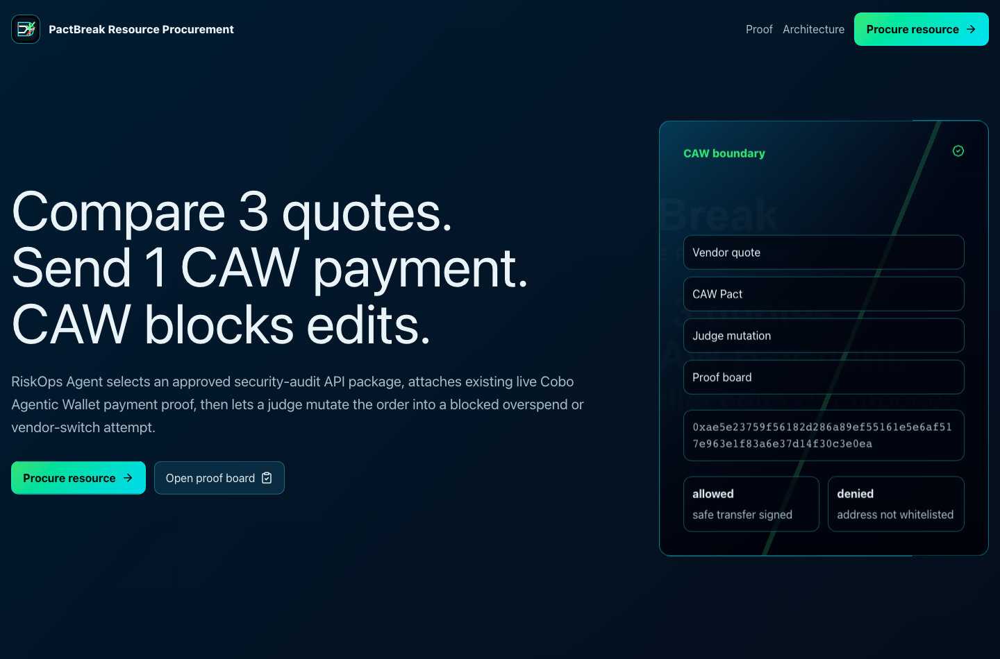
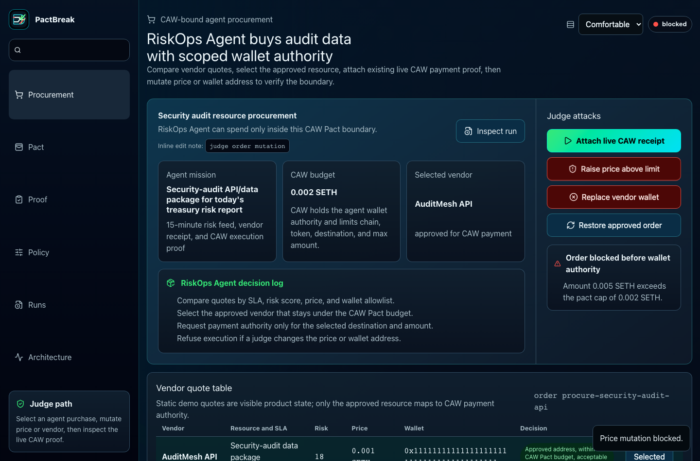
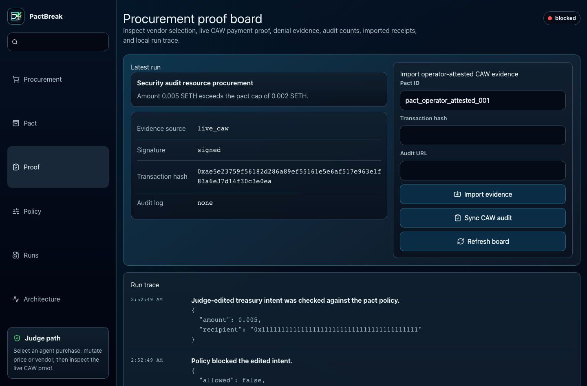
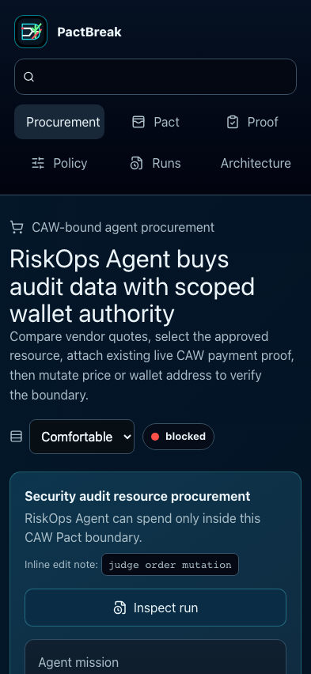
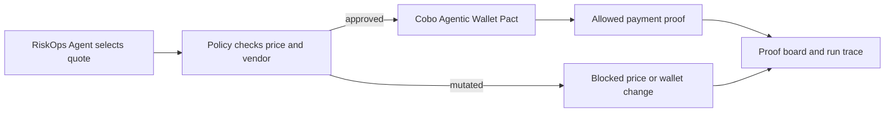

<div align="center">



# PactBreak Resource Procurement

> **Compare 3 vendor quotes, send 1 CAW payment in 60 seconds.**

PactBreak is a runnable demo where a RiskOps Agent buys 1 approved security-audit API/data package with Cobo Agentic Wallet authority. The agent compares vendor quotes, SLA, risk, wallet allowlist, and price, then requests CAW-bound payment authority. Existing live CAW proof: Pact `59f67ec0-8b3c-4d26-9403-0f70f083e3ec`, tx `0xae5e23759f56182d286a89ef55161e5e6af517e963e1f83a6e37d14f30c3e0ea`, denial `ADDRESS_NOT_WHITELISTED`.

[](https://pactbreak-treasury-firewall.veithly.workers.dev)
[](https://pactbreak-treasury-firewall.veithly.workers.dev/app/proof)
[](#live-caw-proof)
[](https://raw.githubusercontent.com/veithly/pactbreak-resource-procurement/main/submission-media/pactbreak-demo-zh-2min.mp4)

**Quick links:** [Live app](https://pactbreak-treasury-firewall.veithly.workers.dev) · [Demo video](https://raw.githubusercontent.com/veithly/pactbreak-resource-procurement/main/submission-media/pactbreak-demo-zh-2min.mp4) · [Deck PDF](https://raw.githubusercontent.com/veithly/pactbreak-resource-procurement/main/submission-media/pactbreak-pitch-deck-zh-2min.pdf) · [Pitch deck video](https://raw.githubusercontent.com/veithly/pactbreak-resource-procurement/main/submission-media/pactbreak-pitch-deck-zh-2min.mp4) · [Architecture](./docs/ARCHITECTURE.md) · [Deployment](./docs/DEPLOYMENT.md) · [Proof board](https://pactbreak-treasury-firewall.veithly.workers.dev/app/proof)

</div>

---

## Why It Matters

Agentic Commerce needs more than a wallet button. An agent needs authority to spend, but that authority has to be narrow enough that a changed quote, price, token, or vendor address cannot drain funds.

PactBreak turns that boundary into a product loop. The agent selects an approved resource vendor. CAW supplies the wallet boundary. A judge mutates the order, then inspects the denial reason, allowed transaction hash, and audit counts.

| Question | Broad server wallet | Manual approval row | PactBreak |
| --- | --- | --- | --- |
| Can the agent buy a resource? | Yes, with too much authority | Only after human handling | **Yes, through CAW-bound authority** |
| Can a judge change the order? | Usually hidden | Usually no | **Yes: mutate price or vendor wallet** |
| Does enforcement happen before signature? | Often unclear | Human-only | **Yes: policy and CAW Pact scope** |
| Is there durable proof? | Logs or screenshots | Approval row | **Pact ID, tx hash, denial, audit counts, quote trace** |

## Demo Path

<table>
  <tr>
    <td width="50%"></td>
    <td width="50%"></td>
  </tr>
  <tr>
    <td><b>1.</b> Open the app. The first action is an agent resource purchase, not a marketing page.</td>
    <td><b>2.</b> Review three vendor quotes. Only the approved vendor fits price, risk, SLA, and wallet allowlist.</td>
  </tr>
  <tr>
    <td width="50%"></td>
    <td width="50%"></td>
  </tr>
  <tr>
    <td><b>3.</b> Attach existing live CAW proof, then mutate price or vendor address and inspect the block.</td>
    <td><b>4.</b> The same first-run path works from a phone-sized viewport.</td>
  </tr>
</table>

## Live CAW Proof

The prototype uses existing live CAW evidence as the payment and denial proof. It does not claim a new vendor settlement unless a fresh CAW run is executed with matching destination and amount.

| Field | Value |
| --- | --- |
| Pact ID | `59f67ec0-8b3c-4d26-9403-0f70f083e3ec` |
| Allowed tx hash | `0xae5e23759f56182d286a89ef55161e5e6af517e963e1f83a6e37d14f30c3e0ea` |
| Allowed tx id | `816cd936-cdcb-4d53-a76c-ea65070a0e3e` |
| Denied code | `ADDRESS_NOT_WHITELISTED` |
| Denied reason | `no_pact_transfer_allow_policy_matched` |
| Audit counts | `allowed=19`, `denied=1` |
| Evidence source | `live_caw` |

Missing CAW credentials produce `configuration_blocked`. Pasted receipts are labeled as operator-attested imports.

## Quick Start

```bash
npm install
cp .env.example .env.local
npm run dev:demo
```

Open <http://localhost:4388>, choose **Procure resource**, attach the live CAW receipt, then mutate price or vendor wallet.

Server-only CAW variables live in `.env.local` for local development and platform secrets or variables for deployment:

```text
AGENT_WALLET_API_URL
AGENT_WALLET_API_KEY
AGENT_WALLET_WALLET_ID
CAW_SOURCE_ADDRESS
CAW_DESTINATION
CAW_CHAIN_ID
CAW_TOKEN_ID
```

Do not expose `AGENT_WALLET_API_KEY` or the Pact-scoped key to the browser.

## How It Works



| Layer | Choice | Why |
| --- | --- | --- |
| Frontend | Next.js App Router, React, custom operational UI | Fast first-run path with desktop and mobile proof surfaces |
| Wallet authority | `@cobo/agentic-wallet` | CAW is the signing and audit boundary, not a badge |
| Policy engine | Deterministic TypeScript rules | Judges can predict why an order passed or failed |
| Storage | Local JSON in dev, D1 target documented | Keeps hackathon proof inspectable while naming the production hardening step |
| Verification | Playwright, typecheck, build, public API smoke, visual QA | Proves the first-run procurement path and layout health |

Full diagrams and boundary notes live in [docs/ARCHITECTURE.md](./docs/ARCHITECTURE.md).

## Cobo Track Fit

| Cobo judging angle | PactBreak evidence |
| --- | --- |
| Agentic Commerce | RiskOps Agent procures a security-audit data/API package. |
| CAW criticality | CAW limits wallet authority by chain, token, destination, and amount. Removing it leaves only a local quote table. |
| Funds flow completeness | Quote selection -> CAW-bound payment proof -> mutated order denial -> proof board. |
| Demo stability | Fresh visitor can run the hero path without login. |
| Risk boundary | Existing live proof is labeled honestly; missing keys and imported receipts have separate states. |

## Safety Boundary

- CAW API keys stay server-side.
- No private key is stored in this repo.
- The demo uses SETH/testnet-style assets, not mainnet funds.
- Unsafe edits are blocked before transfer execution.
- Existing proof is reused for the prototype and labeled as `live_caw`.
- Imported evidence stays labeled as imported.
- The production hardening path is D1-backed run storage and team auth.

## Repository Layout

```text
.
├── src/app/                 Next.js routes and API endpoints
├── src/components/          Procurement console, proof board, pact console, policy lab
├── src/lib/                 CAW adapter, policy engine, run store, shared types
├── scripts/                 CAW drill helper
├── tests/                   Playwright onboarding proof
├── docs/                    Architecture, deployment, public screenshots
└── public/                  Brand assets, favicon, and OG images
```

## Verification

```bash
npm run typecheck
npm run build
npm run test:onboard
```

Hunter G4-G7 gates passed on `2026-06-10`: product slice, feature density, claims, runtime, realness, final video, submission copy, judge red-team, and external skill usage.

## Deployment

Live URL: <https://pactbreak-treasury-firewall.veithly.workers.dev>

Current deployed version recorded in gate evidence: `d85d83b8-afe5-4485-8510-1c71981d192c`

See [docs/DEPLOYMENT.md](./docs/DEPLOYMENT.md) for setup, secrets, deploy commands, and smoke checks.
