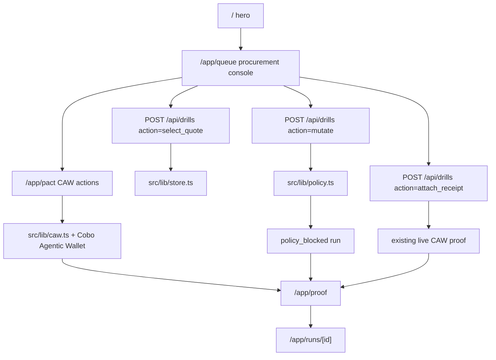
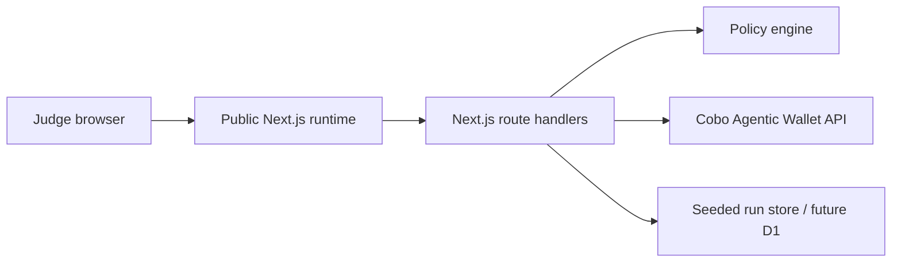

# Architecture

PactBreak Resource Procurement is a CAW-bound agent commerce prototype. RiskOps Agent selects a security-audit data/API package, CAW constrains payment authority, and a judge can mutate price or vendor wallet to verify the boundary before funds move.

## Runtime Flow

## Main Surfaces

| Route | Purpose | Proof |
| --- | --- | --- |
| `/` | Five-second claim and entry point | Procurement hero and live demo CTA |
| `/app/queue` | Agent mission, vendor quotes, CAW receipt, judge mutation controls | Selected vendor, amount, wallet, status, run id |
| `/app/pact` | Operator submits/polls Pact and executes approved purchase | Pact ID, scoped-key state, tx or blocker |
| `/app/proof` | Evidence board | CAW proof, local block, imported evidence, audit counts |
| `/app/runs/[id]` | One run trace | Timeline, selected vendor, raw evidence fields |
| `/app/policy` | Policy lab | Cap, token, denylist, reason glossary |
| `/about` | Public technical notes | Boundaries and limitations |

## Core Modules

| Module | Responsibility |
| --- | --- |
| `src/lib/policy.ts` | Validates amount, vendor wallet, purpose, chain, token, and builds the CAW Pact spec. |
| `src/lib/caw.ts` | Wraps Cobo Agentic Wallet SDK/API calls for Pact submit, poll, transfer, tx fetch, and audit sync. |
| `src/lib/store.ts` | Persists procurement orders, vendor quotes, run events, seeded live CAW proof, and sanitized public state. |
| `src/components/TreasuryConsole.tsx` | First-run procurement and mutation surface. |
| `src/components/PactConsole.tsx` | CAW readiness and operator actions. |
| `src/components/ProofBoard.tsx` | Evidence inspection and import surface. |
| `src/components/PolicyLab.tsx` | Deterministic rule playground. |

## Procurement Model

The seeded order has three quotes:

| Vendor | Status | Reason |
| --- | --- | --- |
| AuditMesh API | selected | approved address, within CAW Pact budget, acceptable SLA |
| Sentinel Plus | rejected | price exceeds the Pact amount limit |
| Shadow Index | rejected | vendor wallet is not allowlisted |

Each run carries `ownerId`, `agentId`, `selectedQuoteId`, `evidenceSource`, amount, recipient, and timeline events.

## Policy Boundary

The P0 policy allows only a narrow resource purchase:

| Rule | Value |
| --- | --- |
| Chain | `SETH` by default |
| Token | `SETH` by default |
| Max amount | `0.002` |
| Intended purpose | `security-audit API/data package procurement` |
| Denylisted recipients | zero address and `0xdead00000000000000000000000000000000beef` |
| Approval window | 24 hours |

Unsafe inputs produce a local `policy_blocked` run before any CAW transfer attempt. Safe inputs still require CAW credentials and an approved Pact before fresh transfer execution.

## CAW Integration

`src/lib/caw.ts` uses the Cobo Agentic Wallet SDK for:

- `PactsApi.submitPact`
- `PactsApi.getPact`
- `TransactionsApi.transferTokens`
- `AuditApi.listAuditLogs`

The transfer body includes `src_addr` from `CAW_SOURCE_ADDRESS` because the current CAW API requires it at runtime.

## Evidence Labels

| Label | Meaning |
| --- | --- |
| `live_caw` | Captured from real CAW Pact, transfer, denial, and audit calls. |
| `configuration_blocked` | Required server env is missing. The app records the blocker instead of faking success. |
| `operator_attested_imported` | A human pasted real external CAW proof. It is not labeled as live browser execution. |
| `policy_blocked` | Local deterministic rules blocked the mutation before wallet execution. |

Existing live CAW proof is reused as prototype payment evidence. The app does not claim that the existing tx settled a new vendor order unless a fresh run proves matching destination and amount.

## Storage

Local development writes `.hunter/local-db/drills.json`. The deployed Worker cannot rely on a writable filesystem, so the current public demo uses seeded proof and in-isolate state for runtime interactions. The production hardening path is D1-backed runs and evidence.

The repo names this limitation because storage honesty matters for a fund-control demo. The CAW proof itself remains real and inspectable.

## Security Boundary

- CAW API credentials are server-only.
- Pact-scoped keys are stripped before drill objects reach the browser.
- No private key is stored or rendered.
- The UI does not show a successful tx state unless a tx hash exists.
- Imported proof remains visually and structurally separate from `live_caw`.
- Mainnet operation, arbitrary send forms, production auth, and multi-vendor discovery are outside P0.

## Deployment Shape

The runtime keeps CAW calls server-side. Platform secrets store credentials for deployed runtime; `.env.local` stores local credentials.

## Verification Evidence

| Check | Status |
| --- | --- |
| `npm run typecheck` | Passed on 2026-06-10 |
| `npm run build` | Passed on 2026-06-10 |
| `npm run test:onboard` | Passed on 2026-06-10 |
| Hunter runtime/realness/video/submission gates | Passed on 2026-06-10 |
| Public API smoke | Passed on deployed Worker `d85d83b8-afe5-4485-8510-1c71981d192c` |
| Visual QA desktop/mobile | Passed on local and public routes |
